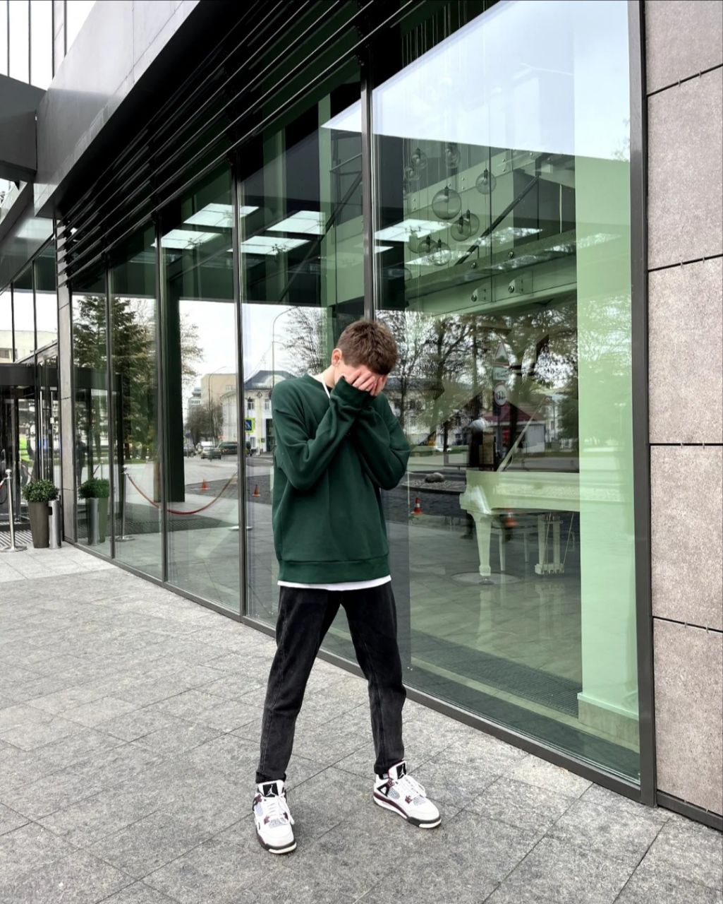

## Curriculum Vitae


## Ivan Samolazov, 19 y.o

[Telegram](https://t.me/flapir "link")


[Instagram](https://www.instagram.com/flap1r/ "link")

isamolazov@gmail.com

Phone +375 (33) 68-21-810

#### I am a 2nd year student majoring in software engineering. My goal is to become a qualified front-end software developer and contribute to the development of modern web technologies. My priorities include an in-depth study of major programming languages such as HTML, CSS and JavaScript, the development of effective and high-quality code for web applications, as well as an understanding of modern methodologies and tools used in front-end development.

|Hard skills| Soft slills|
|-------------|------------|
|Knowledge of programming languages HTML, CSS, JS|Responsibility|
|Figma online service skills|Ability to perform in public|
|Knowledge of SQL,C#|Teamwork|
|Familiar with OOP basics|Analytical thinking|
|Knowledge of bootstrap framework|Focus on results|
|Knowledge of Git|    |

***

## Languages
* Russian
* English (A2)

## Work Experience
[https://github.com/Flap1R/curriculumvitae]

## Code Examples
```
$ (document).ready(function(){
   
    $('.next').click(function(){
        var currentImage = $('.img.curry');
        var currentImageIndex = $('.img.curry').index();
        var nextImageIndex = currentImageIndex + 1;
        var nextImage = $('.img') .eq(nextImageIndex);
        currentImage.fadeOut(1000);
        currentImage.removeClass('curry');
    
    if(nextImageIndex == ($('.img:last').index()+1)){
        $('.img').eq(0).fadeIn(1000);
        $('.img').eq(0).addClass('curry');
    } else {
        nextImage.fadeIn(1000);
        nextImage.addClass('curry');
    }
    });
    $('.prev').click(function(){
        var currentImage = $('.img.curry');
        var currentImageIndex = $('.img.curry').index();
        var prevImageIndex = currentImageIndex - 1;
        var prevImage = $('.img') .eq(prevImageIndex);
        currentImage.fadeOut (1000);
        currentImage.removeClass ('curry');
        prevImage.fadeIn(1000);
        prevImage.addClass('curry');
    });
});
```

